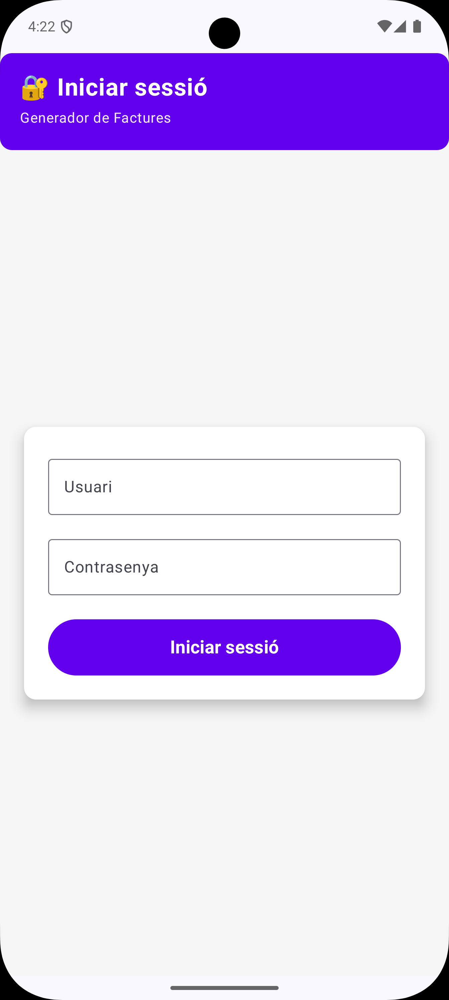
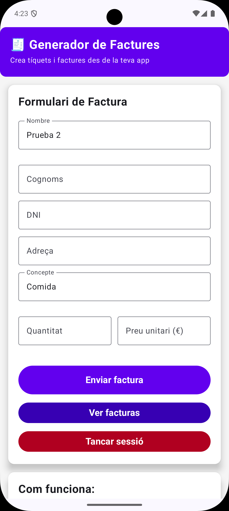
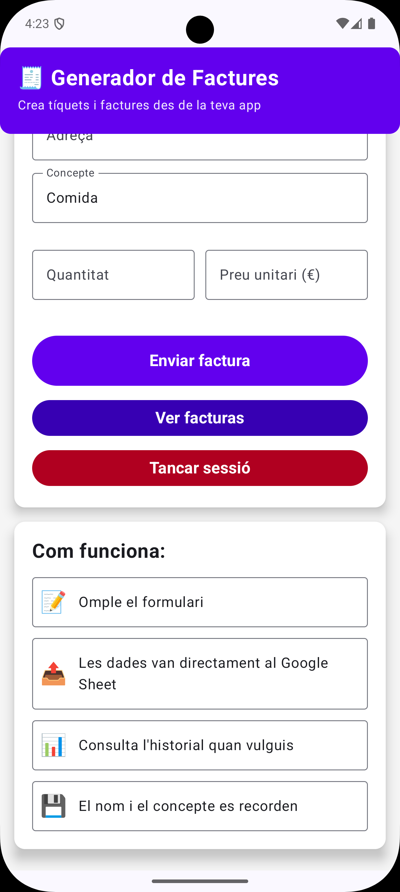
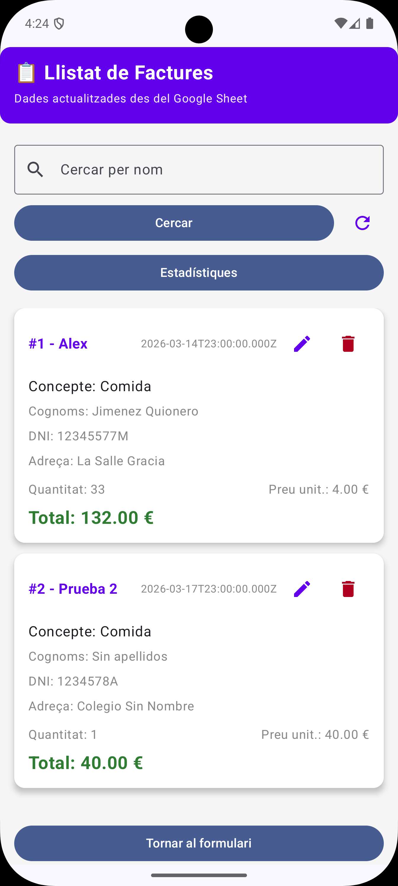

# 📄 App_Script_API - Generador de Facturas

Aplicación de gestión de facturas desarrollada en **Kotlin** con **Jetpack Compose** siguiendo el patrón de arquitectura **MVVM**, integrada con **Google Apps Script API** para operaciones CRUD en tiempo real sobre una hoja de cálculo.

## 📱 Descripción

App_Script_API es una aplicación Android que permite crear, listar, buscar, actualizar y eliminar facturas. Los datos se almacenan en una **Google Sheet** mediante un script desplegado en **Google Apps Script**. La app incluye login con persistencia de credenciales, formulario de creación/edición y pantalla de listado con estadísticas.

## ✨ Características

- 🔐 **Login**: Pantalla de inicio de sesión con validación (Usuario/1234)
- 💾 **Persistencia de credenciales**: SharedPreferences para recordar usuario y contraseña
- 📝 **Formulario de facturas**: Crear facturas con nombre, apellidos, DNI, dirección, concepto, cantidad y precio
- 📋 **Listado de facturas**: Visualización con LazyColumn y Cards
- 🔍 **Búsqueda por nombre**: Filtrado dinámico de facturas
- 📊 **Estadísticas**: Total de facturas, suma total y media por factura
- ✏️ **Editar facturas**: Actualización de facturas existentes
- 🗑️ **Eliminar facturas**: Borrado con diálogo de confirmación
- 🌐 **Integración con Google Apps Script**: API REST para operaciones CRUD
- 🧭 **Navegación fluida**: Navigation Compose entre Login, Formulario y Facturas
- 🎨 **Interfaz moderna**: Jetpack Compose y Material Design 3
- ⚡ **Operaciones asíncronas**: Kotlin Coroutines y StateFlow
- 🔄 **Estado de carga**: Indicador visual durante las peticiones a la API
- 📱 **Autocompletado**: Último nombre y concepto guardados para el formulario

## 🏗️ Arquitectura

El proyecto sigue el patrón **MVVM (Model-View-ViewModel)** con StateFlow para gestión reactiva de datos y Retrofit para consumo de la API de Google Apps Script:

```
├── model/
│   ├── Factura.kt              # Data class de factura (id, nombre, apellidos, dni, etc.)
│   ├── Estadisticas.kt          # Modelo de estadísticas (totalFacturas, sumaTotal, mediaFactura)
│   ├── GetResponse.kt           # Wrapper de respuesta GET (status, data, error)
│   └── PostResponse.kt          # Wrapper de respuesta POST (status, message, error)
├── network/
│   ├── FacturaApiService.kt     # Interfaz Retrofit + CrearRequest, EliminarRequest, ActualizarRequest
│   └── RetrofitInstance.kt      # Singleton Retrofit + Gson
├── routes/
│   └── Routes.kt                # Sealed class Routes (Login, Formulario, Facturas)
├── repository/
│   └── SettingsRepository.kt    # SharedPreferences (credenciales, último nombre/concepto)
├── view/
│   ├── LoginScreen.kt           # Pantalla de login
│   ├── FormularioScreen.kt      # Pantalla para crear/editar facturas
│   └── FacturasScreen.kt        # Pantalla de listado, búsqueda y estadísticas
├── viewmodel/
│   └── FacturaViewModel.kt      # Lógica y gestión de estado con corrutinas
├── ui/theme/
│   ├── Color.kt                 # Colores y estilos
│   ├── Theme.kt                 # Tema de la app
│   └── Type.kt                  # Tipografía
├── app-script/
│   └── Code.gs                  # Script de Google Apps Script (desplegar en Google)
└── MainActivity.kt               # Actividad principal con NavHost
```

## 🎨 Capturas de Pantalla

### Pantalla de Login


### Formulario de Facturas Parte 1


### Formulario de Facturas Parte 2


### Listado de Facturas


## 🚀 Tecnologías Utilizadas

- **Lenguaje**: Kotlin
- **UI Framework**: Jetpack Compose
- **Arquitectura**: MVVM
- **Gestión de estado**: StateFlow (MutableStateFlow)
- **Navegación**: Navigation Compose
- **Material Design 3**: Material3 Components
- **Lazy Components**: LazyColumn para listas eficientes
- **API REST**: Retrofit 2 + Gson Converter
- **Asincronía**: Kotlin Coroutines (viewModelScope)
- **Persistencia local**: SharedPreferences
- **API externa**: Google Apps Script (Web App desplegada)

## 📋 Funcionalidades Técnicas

### Modelo de Datos (Factura.kt)
- **Factura Data Class**: Clase principal con:
  - `id`, `nombre`, `apellidos`, `dni`, `direccion`, `concepto`
  - `cantidad`, `precioUnitario`, `total`, `fecha`

### Estadisticas.kt
- `totalFacturas`: Número total de facturas
- `sumaTotal`: Suma de todos los totales
- `mediaFactura`: Media por factura

### FacturaApiService (Retrofit)
- **GET**: `getFacturas()`, `buscarPorNombre()`, `getEstadisticas()`
- **POST**: `crearFactura()`, `eliminarFactura()`, `actualizarFactura()`
- Endpoint base: `https://script.google.com/macros/s/.../exec`

### SettingsRepository
- **Credenciales**: `guardarCredenciales()`, `obtenerUser()`, `obtenerPwd()`, `estaLogueado()`, `cerrarSesion()`
- **Autocompletado**: `guardarUltimoNombre()`, `obtenerUltimoNombre()`, `guardarUltimoConcepto()`, `obtenerUltimoConcepto()`

### FacturaViewModel
- **StateFlow**: `facturas`, `facturasFiltradas`, `estadisticas`, `loading`, `error`, `enviado`
- **Funciones**: `cargarFacturas()`, `buscarPorNombre()`, `cargarEstadisticas()`, `crearFactura()`, `eliminarFactura()`, `actualizarFactura()`
- **Persistencia**: Delegación a SettingsRepository

### Navegación
- **Routes.kt**: Sealed class con `Login`, `Formulario`, `Facturas`
- **Flujo**: Login → Formulario (si logueado) → Facturas
- **startDestination**: Formulario si está logueado, Login si no

### AndroidManifest
- **Permiso INTERNET**: Necesario para las llamadas a la API de Google Apps Script

## 🎮 Cómo Usar la App

1. **Login**: Introduce Usuario (Usuario) y contraseña (1234) para acceder
2. **Formulario**: Crea una nueva factura con los datos solicitados
3. **Listado**: Navega a Facturas para ver todas las facturas
4. **Búsqueda**: Busca facturas por nombre en la barra de búsqueda
5. **Estadísticas**: Visualiza total de facturas, suma total y media
6. **Editar**: Pulsa el icono de editar en una factura para modificarla
7. **Eliminar**: Pulsa el icono de eliminar y confirma en el diálogo

## 🛠️ Instalación

1. Clona el repositorio:
```bash
git clone https://github.com/tu-usuario/pr09-apps-script-api-alex_jimenez_alexandra_sofronie.git
```

2. Abre el proyecto en **Android Studio**

3. Sincroniza las dependencias de Gradle

4. **Configura tu API Key y URL**:
   - Crea el archivo `App_Script_API/app/secrets.properties`:
   ```
   API_KEY=tu_clave_api
   BASE_URL=https://script.google.com/macros/s/TU_SCRIPT_ID/exec
   ```
   - Despliega el script `Code.gs` en Google Apps Script como Web App
   - Usa la URL de ejecución como `BASE_URL`

5. **Permiso de Internet** (ya incluido en `AndroidManifest.xml`)

6. Ejecuta la aplicación en un emulador o dispositivo físico

## 📦 Requisitos

- Android Studio Hedgehog o superior
- Kotlin 2.0+
- Android SDK 24+ (Android 7.0)
- Gradle 8.0+
- Jetpack Compose
- **Conexión a Internet** (para la API de Google Apps Script)
- **Google Apps Script** desplegado como Web App

## 📚 Dependencias Principales

```gradle
// Retrofit para consumo de API REST
implementation("com.squareup.retrofit2:retrofit:2.11.0")
implementation("com.squareup.retrofit2:converter-gson:2.11.0")

// Kotlin Coroutines (incluido en lifecycle)
implementation("androidx.lifecycle:lifecycle-viewmodel-compose:2.8.7")

// Navigation Compose
implementation("androidx.navigation:navigation-compose:2.8.4")

// Material Icons Extended
implementation("androidx.compose.material:material-icons-extended")
```

## 📝 Características del Código

- ✅ Patrón MVVM correctamente implementado
- ✅ StateFlow para gestión reactiva de estado
- ✅ Kotlin Coroutines para operaciones asíncronas
- ✅ Retrofit 2 para consumo de API REST
- ✅ SharedPreferences para persistencia local
- ✅ Código limpio y organizado
- ✅ Comentarios en español para mejor comprensión
- ✅ Separación clara de responsabilidades (MVVM)
- ✅ Modelo de datos con data classes
- ✅ Manejo de errores con try-catch
- ✅ Componentes reutilizables en Compose
- ✅ Integración con Google Apps Script API
- ✅ Permisos de Internet configurados en `AndroidManifest.xml`

## 👨‍💻 Autores

**Alex Jiménez**  
**Alexandra Sofronie**

Desarrollo Aplicaciones Multiplataforma - La Salle

## 📄 Licencia

Este proyecto es parte de un ejercicio académico para la asignatura M07 - Android Studio.

---

📄 **¡Gestiona tus facturas de forma sencilla!**
